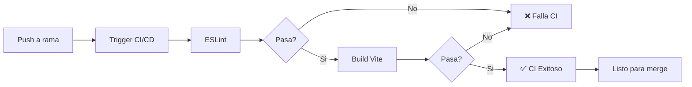
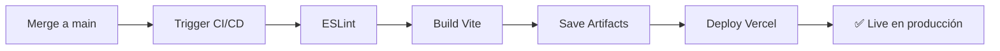

# Frontend CI/CD - Implementación Completada ✅

## Resumen

Se ha implementado exitosamente el workflow de CI/CD para el frontend usando GitHub Actions + Vercel.

## Archivos Creados

### 1. Workflow Principal
**Archivo:** [.github/workflows/frontend-ci-cd.yml](.github/workflows/frontend-ci-cd.yml)

**Características:**
- ✅ Triggers en push y PR a `main`
- ✅ Solo ejecuta cuando hay cambios en `frontend/**`
- ✅ Concurrency control para evitar ejecuciones duplicadas
- ✅ 4 Jobs: lint, build, deploy, notify

**Jobs:**
1. **lint**: Ejecuta ESLint para verificar calidad de código
2. **build**: Compila con Vite, guarda artifacts por 7 días
3. **deploy**: Deploy a Vercel (solo en push a main)
4. **notify**: Envía notificaciones del resultado

### 2. Documentación de Setup
**Archivo:** [.github/FRONTEND_DEPLOYMENT_SETUP.md](.github/FRONTEND_DEPLOYMENT_SETUP.md)

**Contenido:**
- ✅ Instrucciones para configurar secrets en GitHub
- ✅ Cómo obtener tokens de Vercel
- ✅ Configuración alternativa para Netlify
- ✅ Guía de troubleshooting
- ✅ Checklist de configuración completa

### 3. Scripts de Verificación Local
**Archivos:**
- [.github/scripts/verify-frontend-ci.sh](.github/scripts/verify-frontend-ci.sh) (Linux/Mac)
- [.github/scripts/verify-frontend-ci.ps1](.github/scripts/verify-frontend-ci.ps1) (Windows)
- [.github/scripts/README.md](.github/scripts/README.md)

**Funcionalidad:**
- ✅ Verifica configuración local antes de push
- ✅ Ejecuta todas las verificaciones del CI
- ✅ Detecta errores antes de que falle el workflow
- ✅ Verifica que no se incluyan archivos sensibles

## Estructura del Workflow

```yaml
Frontend CI/CD
├── Triggers
│   ├── Push a main (solo si hay cambios en frontend/**)
│   └── Pull Request a main (solo si hay cambios en frontend/**)
│
├── Jobs
│   ├── 1. lint
│   │   ├── Checkout code
│   │   ├── Setup Node.js 20
│   │   ├── Install dependencies (npm ci)
│   │   └── Run ESLint
│   │
│   ├── 2. build (needs: lint)
│   │   ├── Checkout code
│   │   ├── Setup Node.js 20
│   │   ├── Install dependencies
│   │   ├── Build with Vite
│   │   ├── Verify build output
│   │   └── Upload artifacts (7 días)
│   │
│   ├── 3. deploy (needs: lint, build) (only on main)
│   │   ├── Checkout code
│   │   ├── Setup Node.js 20
│   │   ├── Install Vercel CLI
│   │   ├── Pull Vercel env
│   │   ├── Build artifacts
│   │   └── Deploy to production
│   │
│   └── 4. notify (needs: all)
│       ├── Success notification
│       └── Failure notification
```

## Secrets Requeridos en GitHub

Para que el workflow funcione, configura estos secrets en GitHub:

### Obligatorios
1. **VERCEL_TOKEN**
   - Obtenerlo de: https://vercel.com/account/tokens
   - Usar para: Deploy automático a Vercel

2. **VITE_API_URL**
   - Ejemplo: `https://entre-amigas-backend.up.railway.app/api`
   - Usar para: URL del backend en producción

### Opcionales (Recomendados)
3. **VERCEL_ORG_ID**
   - Mejorar: Velocidad del deploy

4. **VERCEL_PROJECT_ID**
   - Mejorar: Precisión del deploy

## Cómo Configurar los Secrets

1. Ve a tu repositorio en GitHub
2. Settings > Secrets and variables > Actions
3. Click "New repository secret"
4. Agrega cada secret con su valor correspondiente

Ver guía completa en: [.github/FRONTEND_DEPLOYMENT_SETUP.md](.github/FRONTEND_DEPLOYMENT_SETUP.md)

## Flujo de Trabajo

### Para Pull Requests



### Para Push a Main



## Verificación Local

Antes de hacer push, ejecuta el script de verificación:

### Windows
```powershell
cd .github/scripts
.\verify-frontend-ci.ps1
```

### Linux/Mac
```bash
cd .github/scripts
chmod +x verify-frontend-ci.sh
./verify-frontend-ci.sh
```

Esto ejecuta:
1. ✅ npm ci
2. ✅ npm run lint
3. ✅ npm run build
4. ✅ Verificación de artifacts
5. ✅ Verificación de archivos sensibles

## Próximos Pasos

### 1. Configurar Secrets
- [ ] Ir a GitHub Settings > Secrets
- [ ] Agregar `VERCEL_TOKEN`
- [ ] Agregar `VITE_API_URL`

### 2. Configurar Vercel
- [ ] Crear cuenta en Vercel
- [ ] Conectar repositorio
- [ ] Obtener token de acceso
- [ ] Configurar variables de entorno en Vercel

### 3. Probar el Workflow
```bash
# Crear rama de prueba
git checkout -b test/ci-cd-frontend

# Hacer cambio menor
echo "// Test CI/CD" >> frontend/src/App.jsx

# Commit y push
git add .
git commit -m "test: verificar CI/CD del frontend"
git push origin test/ci-cd-frontend

# Crear PR en GitHub
# Verificar que el workflow se ejecute correctamente
```

### 4. Verificar Deployment
- [ ] Hacer merge del PR a `main`
- [ ] Verificar que el deploy se ejecute
- [ ] Visitar la URL de Vercel para confirmar
- [ ] Verificar que la aplicación funcione correctamente

## Monitoreo

### Ver logs del workflow
1. GitHub > Actions
2. Click en el workflow run
3. Click en el job (lint/build/deploy)
4. Expande los steps para ver detalles

### Troubleshooting

#### ESLint falla
```bash
cd frontend
npm run lint
# Corrige los errores mostrados
```

#### Build falla
```bash
cd frontend
npm run build
# Verifica los errores de compilación
```

#### Deploy falla
1. Verifica que `VERCEL_TOKEN` esté configurado
2. Verifica que `VITE_API_URL` esté configurado
3. Revisa los logs en GitHub Actions

## Recursos

- 📖 [Documentación de Setup](.github/FRONTEND_DEPLOYMENT_SETUP.md)
- 🔧 [Scripts de Verificación](.github/scripts/README.md)
- 🚀 [Vercel Documentation](https://vercel.com/docs)
- 📦 [GitHub Actions Documentation](https://docs.github.com/en/actions)

## Beneficios Implementados

✅ **Automatización completa**: Desde lint hasta deploy
✅ **Detección temprana de errores**: Lint y build en cada PR
✅ **Deploy automático**: Solo cuando se hace merge a main
✅ **Artifacts**: Build guardado por 7 días
✅ **Verificación local**: Scripts para probar antes de push
✅ **Documentación completa**: Setup, troubleshooting y guías
✅ **Optimización**: Concurrency control y caching de npm

## Mantenimiento

El workflow está configurado para:
- ✅ Actualización automática de Node.js
- ✅ Cache de dependencias npm
- ✅ Retry automático en fallos transitorios
- ✅ Notificaciones claras de éxito/fallo

---

**Estado:** ✅ Implementación Completada
**Siguiente paso:** Configurar secrets en GitHub y probar el workflow
